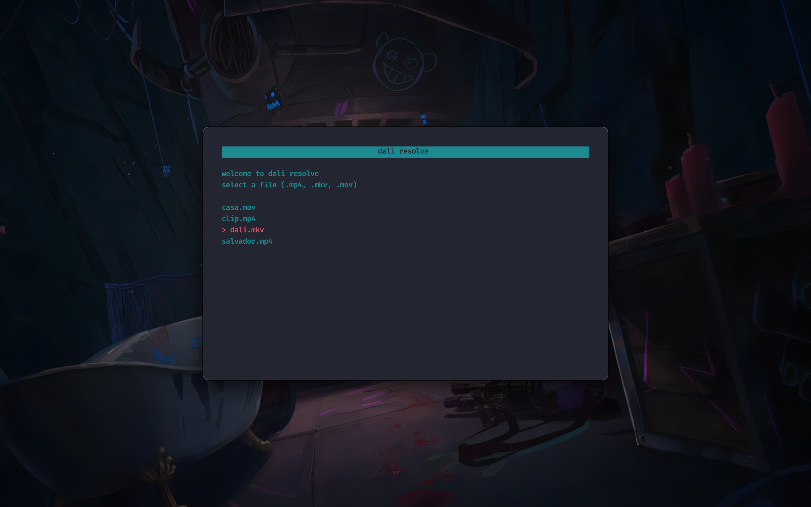

# 🎨 dali
a ffmpeg based tui built on top of [**`tui-base`**](https://github.com/mofeimw/tui)

<p align="center"></p>

## operations
- overlay images
- add subtitles
- optimize/re-encode h.264

## why?
- because davinci resolve is overkill for these simple tasks

- it was a fun project

## dependencies
- `bash`
- `ffmpeg`
          
## usage
```
dali
``` 
